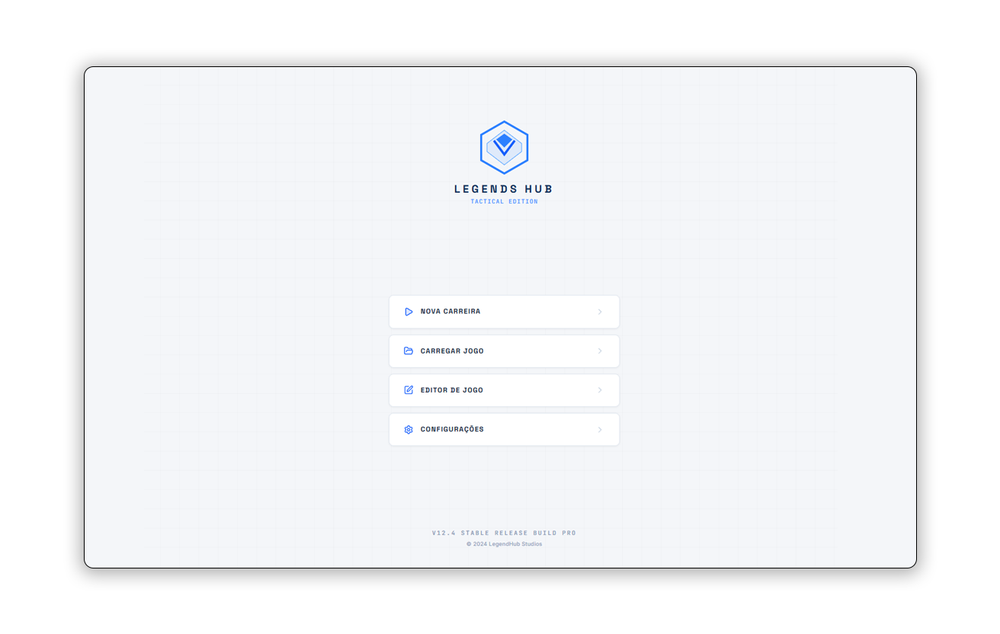

<div align="center">


  <h1 align="center">LegendsHub</h1>

  <p align="center">
    <strong>O Um simulador e gerenciador tático de eSports inspirado no competitivo de League of Legends, no estilo Football Manager e Brasfoot, com ligas, draft, transferências e patches dinâmicos. O LegendsHub foi desenvolvido em Node.js (Electron, React, Typescript) e Python.</strong>
  </p>



  <p align="center">
    <strong>O aplicativo tem uma interface moderna em Modo Escuro, projetada para oferecer conforto visual, imersão e uma experiência premium para gerenciar sua biblioteca de jogos.</strong>
  </p>


</div>

# 🎮 características LegendsHub

[](https://react.dev/)
[](https://vite.dev/)
[](https://www.typescriptlang.org/)
[](https://tailwindcss.com/)
[](https://www.electronjs.org/)
[](https://capacitorjs.com/)

O **LegendsHub** é um ecossistema avançado de gerenciamento de coleções e bibliotecas de jogos pessoais. Projetado para gamers entusiastas, críticos e colecionadores, ele permite catalogar títulos, acompanhar o progresso de jogatina, administrar o seu *backlog*, catalogar suas mídias físicas e analisar estatísticas detalhadas sobre seus hábitos de jogo.

Tudo isso envelopado sob os conceitos do inovador tema **Nexus Terminal** — uma estética cyber-HUD inspirada em painéis de jogos de ficção científica (AAA Modern High-Performance Aesthetics), com superfícies de vidro translúcidas (Glassmorphism), transições fluidas e contrastes de neon intensos sobre tons profundos de ardósia e espaço.

---

## 🚀 Funcionalidades Principais

*   **🗄️ Coleção Inteligente**: Cadastre novos títulos com metadados robustos (gêneros, desenvolvedora, publisher, data de lançamento, plataforma, tempo jogado, barra de progresso, sinopse, link do trailer e indicador de Platinado).
*   **💾 Banco de Dados Dexie (IndexedDB)**: Persistência local robusta que funciona inteiramente offline. Seus dados nunca são expirados pelo navegador de forma inesperada.
*   **📊 Estatísticas Avançadas**: Painéis de análise gráfica ilustrando o total de jogos, horas acumuladas, taxa de conclusão de objetivos, distribuição de plataformas preferidas e ranqueamento de avaliação média (estrelas).
*   **🏆 Ranking Top 10**: Monte seu *Hall of Fame* definitivo posicionando seus 10 jogos preferidos da vida nos espaços de destaque.
*   **💿 Coleção de Mídias Físicas (Prateleira de Discos)**: Um espaço tridimensional/skeuomórfico que emula caixas de Blu-ray e cartuchos físicos, permitindo registrar se o jogo está emprestado ou guardado.
*   **🎲 Recurso "Estou com Sorte"**: Sorteador aleatório de títulos pendentes na sua biblioteca, perfeito para ajudar a decidir qual jogo de seu backlog iniciar hoje.
*   **🗺️ Roadmap Interativo & Changelog**: Canal onde você pode acompanhar futuras melhorias do projeto ou registrar suas próprias metas de atualização e desenvolvimento.
*   **💬 Suporte Multilíngue Completo**: Localização instantânea e intuitiva entre **Português (Brasil)**, **English (US)** e **Español** no menu de configurações.
*   **🛠️ Utilitários de Backup**: Funcionalidade completa para exportação em um único clique (.json), importação inteligente (substituindo ou mesclando dados) e redefinição de banco de dados protegida.

---

## 💻 Arquitetura e Tecnologias

A aplicação foi projetada sob uma pilha tecnológica moderna e escalável:

*   **React 19** como motor SPA declarativo e dinâmico.
*   **Vite 6** proporcionando um ambiente de desenvolvimento instantâneo com bundling otimizado de produção.
*   **Tailwind CSS v4** aplicando um sistema de design responsivo e fluído baseado em variáveis nativas e micro-ajustes.
*   **Motion** para coreografias de entrada de elementos e transições de tela suaves e elegantes.
*   **Dexie.js** para camada ORM elegante sobre a Web API do IndexedDB.
*   **Electron 42 + Electron Builder** para encapsulamento como aplicativo Desktop multiplataforma nativo.
*   **Capacitor 8** para empacotamento ágil de aplicativos mobile (Android nativo).

---

## 🛠️ Como Instalar e Executar (Desenvolvimento Local)

### Pré-requisitos
Certifique-se de possuir instalado em sua máquina o **Node.js** (versão `18.x`, `20.x` ou posterior).

1.  **Obtenha o repositório:**
    ```bash
    git clone https://github.com/davisonsant/GamingHub.git
    cd GamingHub
    ```

2.  **Instale as dependências nativas:**
    ```bash
    npm install
    ```

3.  **Execute o servidor de desenvolvimento local:**
    ```bash
    npm run dev
    ```
    Isso abrirá o servidor web local. Por padrão, vá até seu navegador em: `http://localhost:3000`.

---

## 📦 Como Compilar e Empacotar (Produção)

O GamingHub está totalmente preparado para ser distribuído em múltiplos formatos (Web, Desktop nativo instalável ou portátil e Android).

### 1. 🌐 Compilar para Web (Navegador Clássico)
Gera arquivos estáticos otimizados prontos para hospedagem (Vercel, Netlify, Github Pages, etc.).
```bash
npm run build
```
*Os arquivos de entrega serão gerados no diretório `/dist`.*

---

### 2. 🖥️ Compilar para Desktop (Windows e Linux)
Utilizando o **Electron** configurado na raiz do projeto, você pode empacotar binários instaladores convencionais, portáteis que não exigem instalação e imagens universais de Linux.

Todas as saídas desktop serão convenientemente salvas na pasta pública `/dist_electron`.

#### 🔵 No Windows:
*   **Instalação Padrão (.exe convencional com instalador NSIS completo):**
    Adiciona atalhos, cria instalador guiado de setup e gerencia caminhos no sistema:
    ```bash
    npm run electron:build:win
    ```
*   **Executável Portátil (.exe de clique único - Portable):**
    Não precisa instalar. Roda instantaneamente de qualquer pasta ou pen-drive:
    ```bash
    npm run electron:build:portable
    ```
*   **Compilar para arquiteturas específicas do Windows (64-bits ou 32-bits):**
    ```bash
    # Apenas 64-bits (Sistemas Modernos)
    npm run electron:build:win64
    
    # Apenas 32-bits (Sistemas Antigos)
    npm run electron:build:win32
    ```

#### 🟢 No Linux:
Gera tanto o pacote de instalação nativa de distribuições Debian/Ubuntu (`.deb`) como a imagem portátil autossuficiente (`.AppImage`):
```bash
npm run electron:build:linux
```

#### ⚡ Gerar ambos ao mesmo tempo:
```bash
npm run electron:build:all
```

#### 🛡️ Testar em modo Desktop antes de empacotar:
Deseja emular a execução nativa simulando a janela do sistema Windows/Linux? Execute:
```bash
npm run electron:dev
```

---

### 3. 📱 Compilar para Android (Mobile)
O GamingHub vem pré-configurado com a tecnologia **Capacitor** para permitir a geração de instaladores nativos de sistema de dispositivos móveis.

Para preparar e compilar a sua build de teste Android:

1.  **Inicialize o Capacitor no projeto (caso seja a primeira execução local):**
    ```bash
    npm run android:init
    ```
2.  **Abra ou adicione a plataforma Android ao seu projeto do Android Studio:**
    ```bash
    npm run android:add
    ```
3.  **Sincronize as modificações de web e assets para os recursos móveis:**
    ```bash
    npm run android:sync
    ```
4.  **Compilar e gerar o arquivo APK nativo direto de sua linha de comando:**
    ```bash
    npm run android:build
    ```
    *Isso gerará os binários depuráveis (.apk) na pasta `./android/app/build/outputs/apk/debug/` de forma nativa.*
5.  **Abrir a suite no Android Studio para fins de compilação avançada com chaves de produção:**
    ```bash
    npm run android:open
    ```

---

## 🎨 Como Customizar Ícones e Nome do App

Para personalizar metadados ou branding antes de distribuir:

1.  **Branding e Nome do Aplicativo**:
    Edite o arquivo `package.json` alterando os valores de `"name"`, `"description"`, `"author"`, `"version"` e o campo `build.productName` (que renomeia a janela e o cabeçalho executável).
2.  **Ícones de Distribuição**:
    *   Substitua o arquivo `public/icon.ico` por qualquer imagem ICO contendo tamanhos múltiplos (16x16, 32x32, 48x48, 256x256) para trocar o visual no Windows de forma nativa.
    *   Substitua o arquivo `public/icon.png` por uma versão PNG de alta resolução de 512x512 pixels para alterar o logotipo no Linux.

---

## 📄 Licença

Este projeto é de uso livre e pessoal para entusiastas de tecnologia, design e jogos.

Desenvolvido com carinho por [Davison Sant](https://github.com/davisonsant). 🚀
